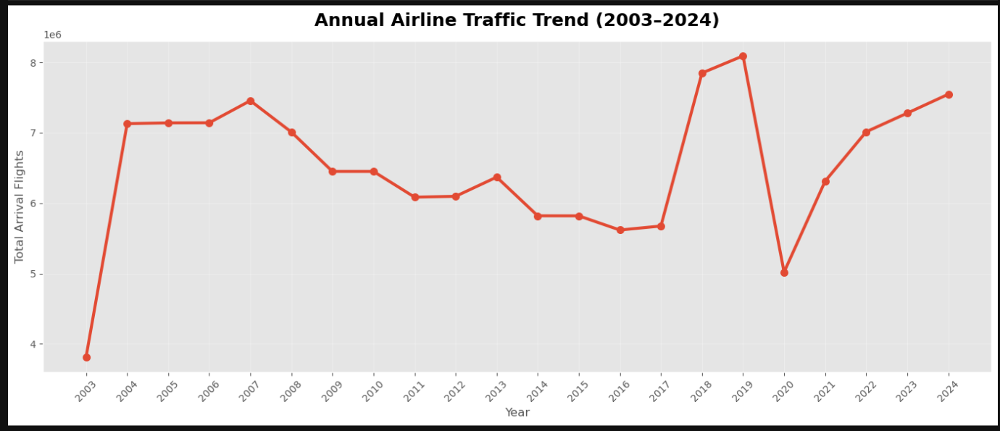
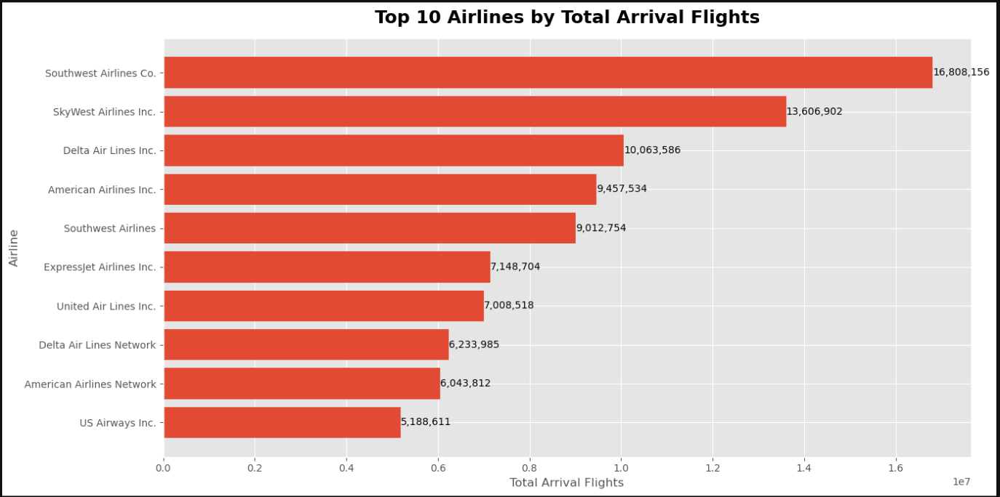
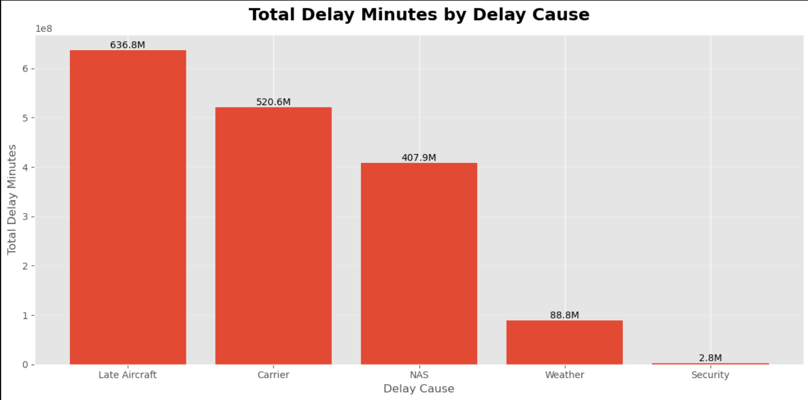
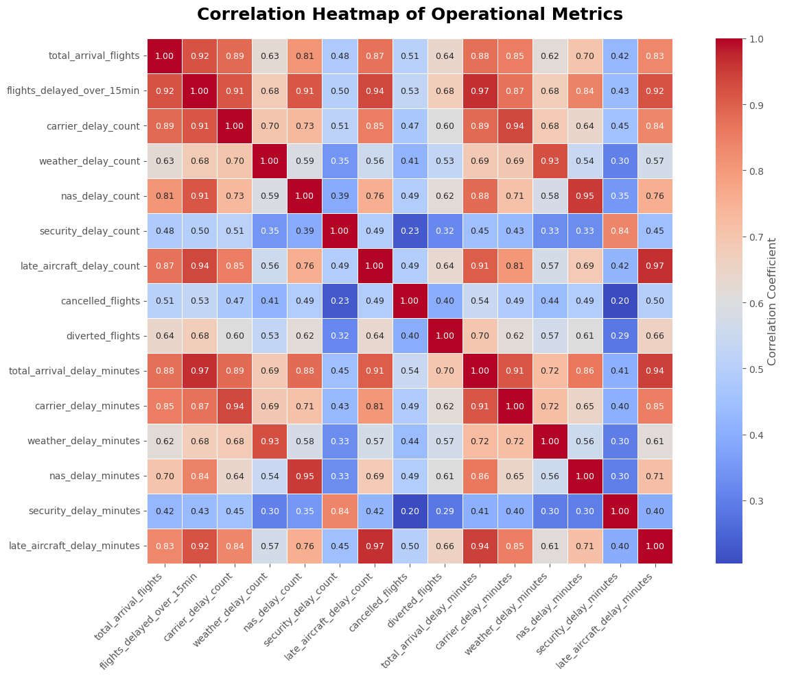

#  Airline Operational Performance Analytics


## Project Overview

Airline delays affect operational efficiency, customer satisfaction, and airline profitability. This project analyzes historical airline operational performance data to identify the major factors contributing to flight delays and transform raw operational data into meaningful business insights.

The project follows a complete data analytics workflow, including data understanding, data cleaning, exploratory data analysis (EDA), feature engineering, and business insights generation.

---

##  Objectives

- Understand airline operational performance trends.
- Identify the major causes of flight delays.
- Analyze airline and airport performance.
- Study seasonal patterns in flight delays.
- Engineer meaningful business features.
- Generate actionable business insights and recommendations.

---

##  Dataset

**Dataset Name:** Airline Delay Cause Dataset

**Source:** Bureau of Transportation Statistics (BTS)

**Time Period:** 2003–2025 (Analysis performed using complete data up to 2024)

**Records:** ~397,000

**Features:** 21 original features

---

##  Technologies Used

- Python
- Pandas
- NumPy
- Matplotlib
- Seaborn
- Jupyter Notebook


---

##  Project Workflow

The project follows a structured data analytics workflow:

1. Data Understanding
2. Data Cleaning
3. Exploratory Data Analysis (EDA)
4. Feature Engineering
5. Business Insights

Each stage builds upon the previous one to transform raw operational data into actionable business insights.

---

##  Repository Structure

```
airline-operational-performance-analytics/
│
├── dataset/
├── cleaned_data/
├── notebooks/
│   ├── 01_data_understanding.ipynb
│   ├── 02_data_cleaning.ipynb
│   ├── 03_exploratory_data_analysis.ipynb
│   ├── 04_feature_engineering.ipynb
│   └── 05_business_insights.ipynb
│
├── images/
├── reports/
├── README.md
├── requirements.txt
└── .gitignore
```

---

##  Notebook Summary

### 1. Data Understanding

- Explored the dataset structure
- Identified data types
- Reviewed missing values
- Understood business context

### 2. Data Cleaning

- Renamed columns for consistency
- Removed duplicate records
- Handled missing values
- Standardized dataset formatting

### 3. Exploratory Data Analysis

- Analyzed yearly flight trends
- Compared airline performance
- Identified major delay causes
- Evaluated airport performance
- Studied seasonal delay patterns
- Performed correlation analysis

### 4. Feature Engineering

Created additional business-focused features including:

- Delay Rate Percentage
- Average Delay per Flight
- On-Time Flights
- On-Time Percentage
- Total Delay Count
- Delay Severity
- Quarter
- Season
- Peak Travel Indicator

### 5. Business Insights

- Summarized key findings
- Identified operational challenges
- Generated strategic recommendations
- Highlighted future improvement opportunities


---
##  Project Visualizations

### Yearly Flight Trends



---

### Top Airlines by Flight Volume



---

### Major Causes of Flight Delays




---

### Correlation Analysis




## Key Business Insights

The analysis revealed several important operational insights:

- Airline traffic showed steady growth over the years, followed by a sharp decline during 2020 and a gradual recovery in subsequent years.
- Carrier delays and late aircraft delays were the primary contributors to overall arrival delays.
- High-traffic airports experienced a greater share of total delay minutes due to increased operational complexity.
- Flight delays varied across different months, indicating the influence of seasonal demand and weather conditions.
- Engineered metrics such as **Delay Rate Percentage** and **On-Time Percentage** provide more meaningful performance comparisons than raw delay counts.

---

##  Strategic Recommendations

Based on the analysis, the following recommendations can help improve airline operations:

- Improve aircraft maintenance and turnaround processes to reduce late aircraft delays.
- Optimize flight scheduling and crew allocation to minimize operational disruptions.
- Enhance coordination with airport authorities during peak travel seasons.
- Monitor key performance indicators such as Delay Rate Percentage and On-Time Percentage to support data-driven decision-making.
- Continuously analyze operational data to identify trends and improve overall efficiency.

---

##  How to Run the Project

1. Clone this repository.

```bash
git clone https://github.com/venkkateshan-57/airline-operational-performance-analytics.git
```

2. Install the required Python packages.

```bash
pip install -r requirements.txt
```

3. Launch Jupyter Notebook.

```bash
jupyter notebook
```

4. Open the notebooks in sequence:

- `01_data_understanding.ipynb`
- `02_data_cleaning.ipynb`
- `03_exploratory_data_analysis.ipynb`
- `04_feature_engineering.ipynb`
- `05_business_insights.ipynb`

---

##  Future Scope

- Build machine learning models to predict flight delays.
- Develop interactive dashboards using Power BI or Tableau.
- Integrate weather and airport traffic datasets for deeper analysis.
- Perform airline-specific and airport-specific performance benchmarking.
- Automate reporting and operational monitoring.

---

## Author

**Venkkateshan**

Aspiring Data Analyst | Python | SQL | Power BI

---
